# A31. Desplegar una Web App Astro

### Estructura del proyecto

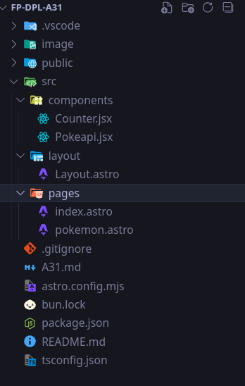

### Dependencias

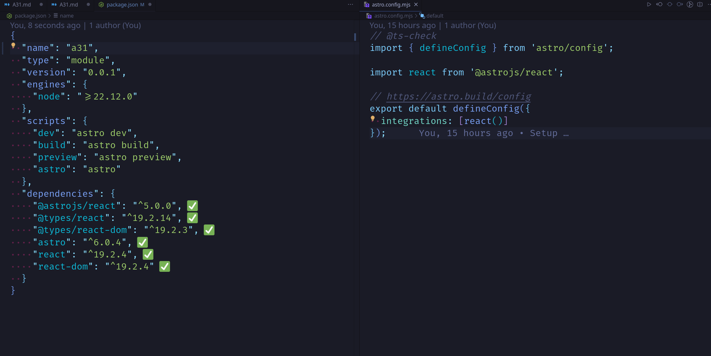

### Despliegue en render (No lei que decia vercel)

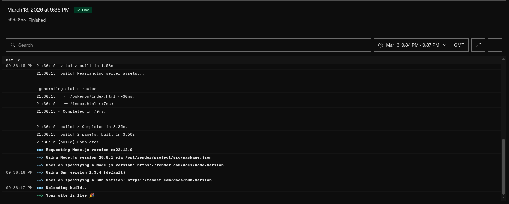

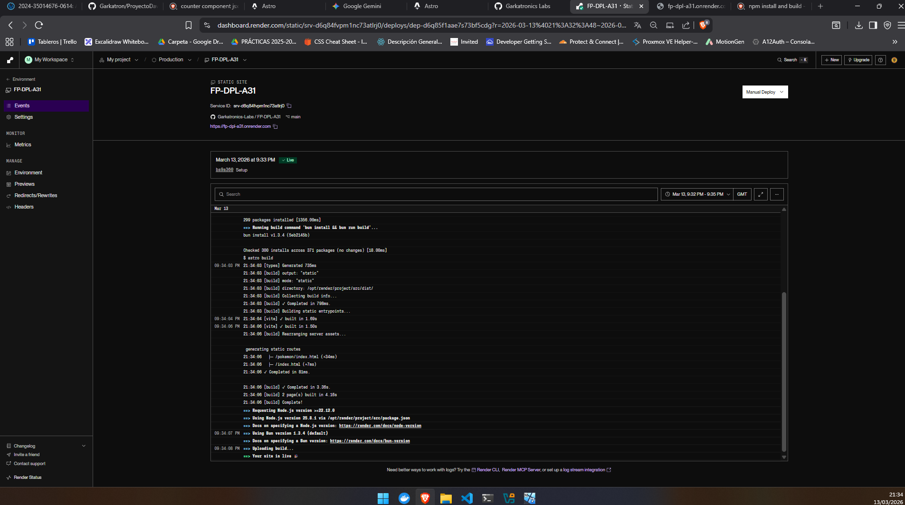

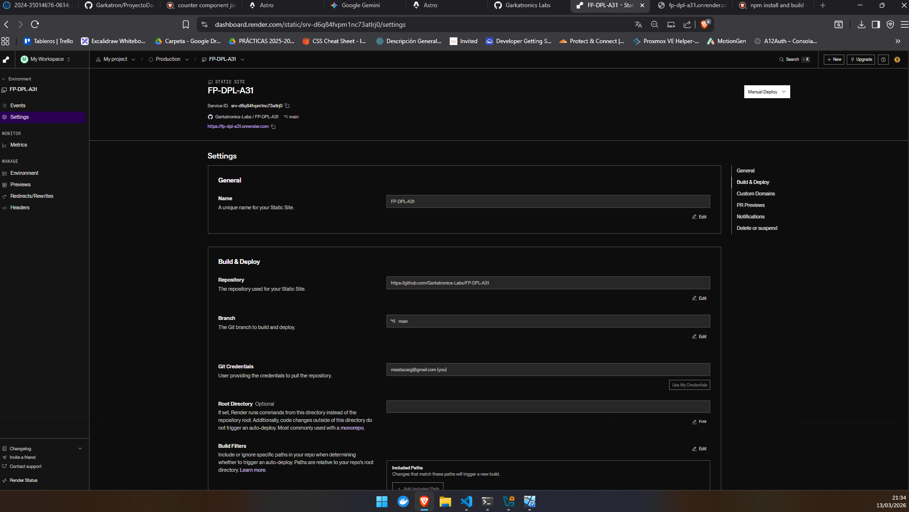

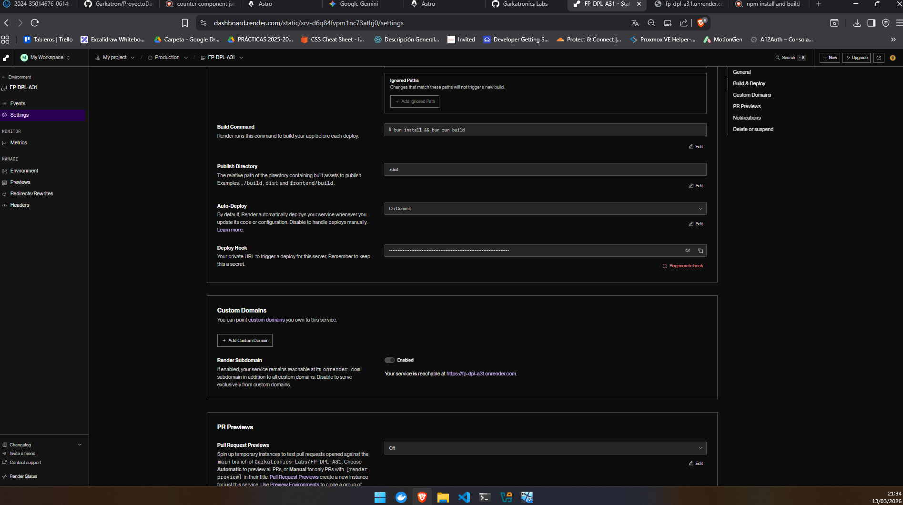

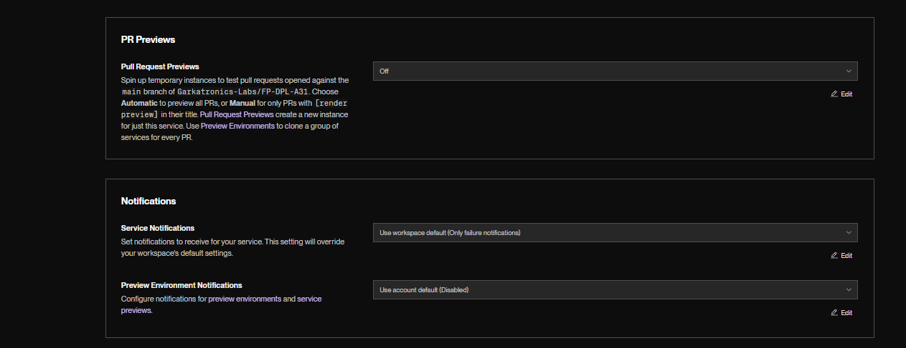

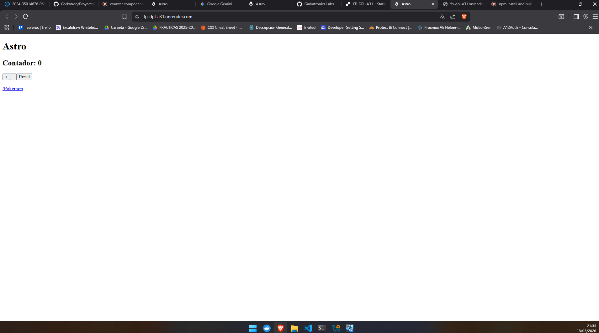

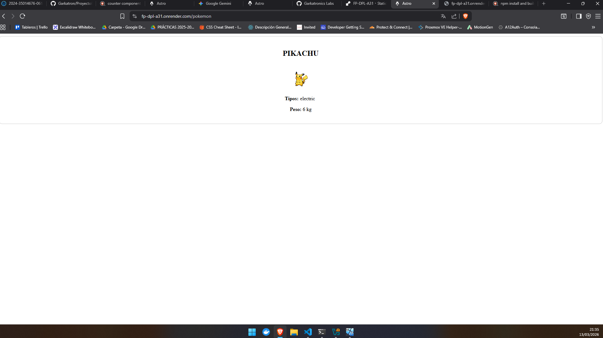

### Despliegue en vercel (doble despliegue da mas nota no?)

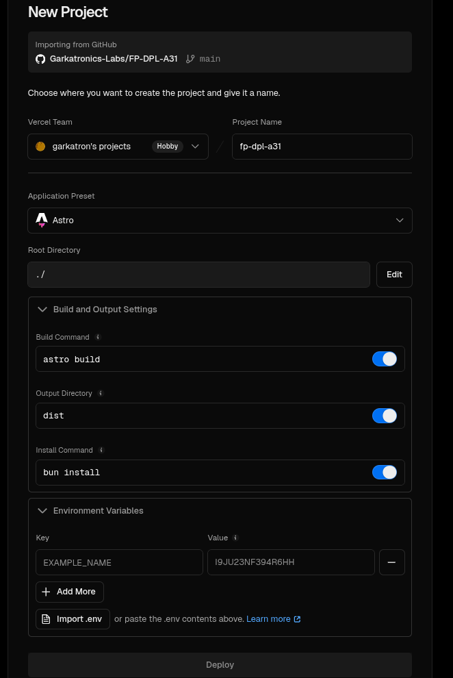

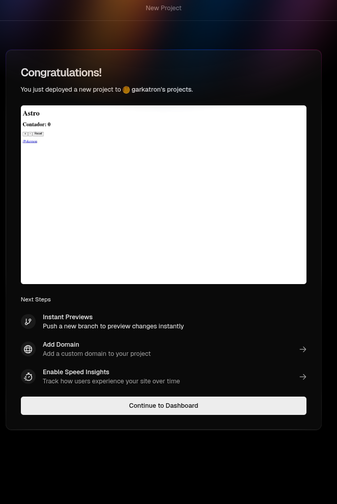

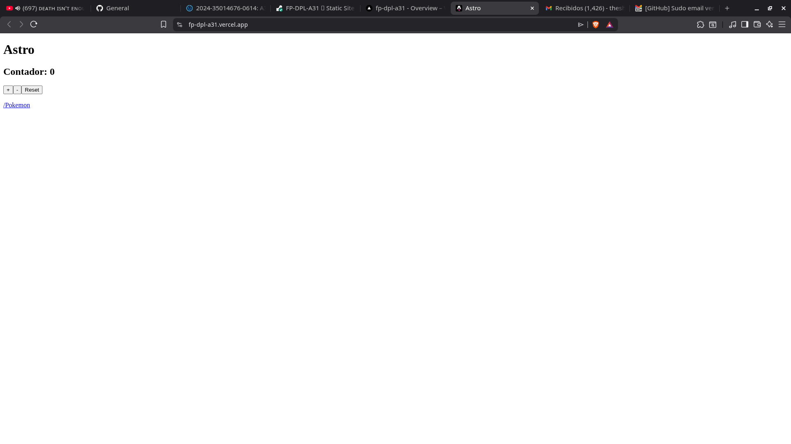

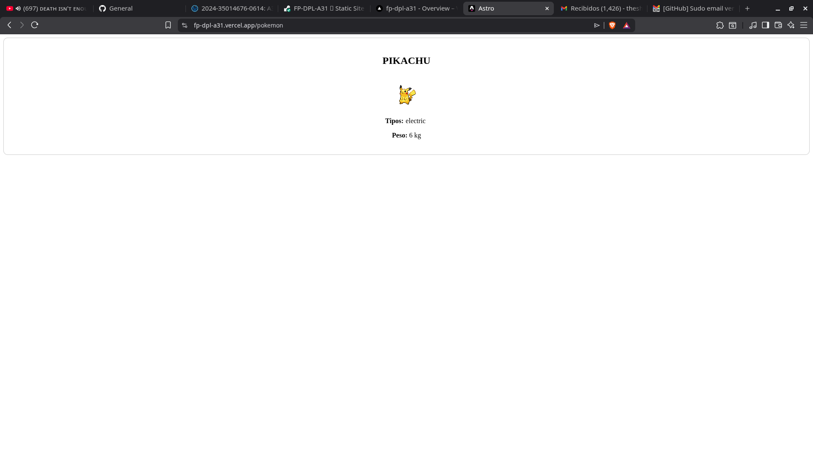

https://fp-dpl-a31.onrender.com/pokemon
